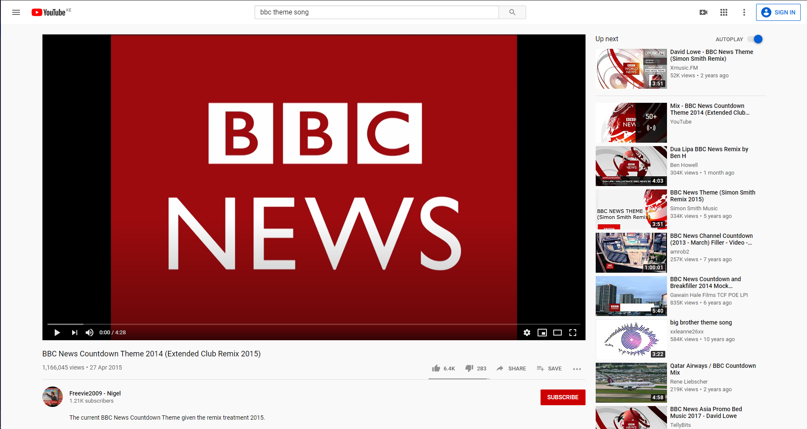
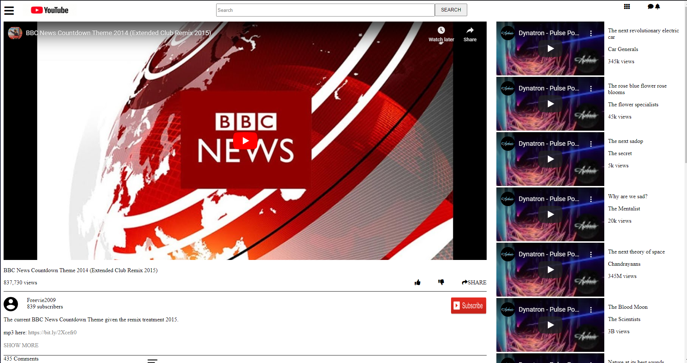

# HTML Forms : Embedding Images and Video

## [Collaborative Project]

This project consisted of building an HTML document that would match the appearance of youtube [video player page](https://www.youtube.com/watch?v=V74l_zS1x8E)

You can find the original project specification [here](https://www.theodinproject.com/courses/html5-and-css3/lessons/embedding-images-and-video)

|Source Page|The cloned page screenshot|
|:---:|:---:|
|||

## Tools Used

- HTML5
- CSS3
- browser-sync
- MarkDown Syntax

## Work Done

- [x] Use Semantic HTML.
- [x] Use basic CSS to size and position elements properly.
- [x] Pass CSS stylelint test.
- [x] Check html with W3C validator.
- [x] Validate Readme file with markdown lint.

LInk to live demo [here](https://RoodzFernando.github.io/youtube-home-page/)

## How to Install and use

- clone the repository ```git clone https://github.com/RoodzFernando/youtube-home-page```
- open command prompt in ```youtube-home-page``` folder
- run the application using open live server functionality.

## Authors social links

### 1. Roodz Fernando

- Github: [@RoodzFernando](https://github.com/RoodzFernando)
- Twitter: [@RoodzFernando](https://twitter.com/RoodzFernando)
- Linkedin: [Roodz Fernando](https://www.linkedin.com/in/roodz-fernando-fleurant/)

### 2. Christian Otieno

- Github: [@christianotieno](https://github.com/christianotieno)
- Twitter: [@iamchrisotieno](https://twitter.com/iamchrisotieno)
- Linkedin: [Christian Otieno](https://www.linkedin.com/in/christianotieno/)